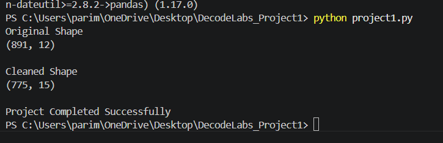

# 📊 DecodeLabs Project 1: Advanced EDA & Feature Engineering

## 🚀 Project Overview

This project was completed as part of the DecodeLabs Data Science Internship Program.

The objective of this project is to transform raw and unstructured data into a clean, machine-learning-ready dataset through Exploratory Data Analysis (EDA) and Feature Engineering techniques.

---

## 🎯 Objectives

* Handle missing values using statistical methods
* Detect and remove outliers using the IQR method
* Create new predictive features from existing data
* Prepare the dataset for machine learning applications

---

## 🛠️ Technologies Used

* Python
* Pandas
* NumPy

---

## 📂 Dataset

Dataset Used: Titanic Dataset

The dataset contains passenger information such as age, fare, gender, passenger class, and survival status.

---

## 📋 Tasks Performed

### 1️⃣ Missing Value Handling

Missing values were handled using statistical imputation techniques:

* Age → Median
* Fare → Median
* Embarked → Mode

---

### 2️⃣ Outlier Detection and Removal

Outliers were identified and removed using the Interquartile Range (IQR) method.

This helped improve data quality and reduce the impact of extreme values.

---

### 3️⃣ Feature Engineering

Three new predictive features were created:

| Feature      | Description                                       |
| ------------ | ------------------------------------------------- |
| FamilySize   | Total family members traveling together           |
| IsAlone      | Indicates whether a passenger was traveling alone |
| AgeFareRatio | Ratio between age and fare                        |

---

## 📈 Results

* Missing values successfully handled
* Outliers removed
* New features engineered
* Dataset prepared for Machine Learning workflows

---

## 📸 Output Screenshot

Add your output screenshot below:

---

## 📁 Project Structure

DecodeLabs_Project1

├── titanic.csv

├── cleaned_titanic.csv

├── project1.py

├── output.png

└── README.md

---

## 🎓 Learning Outcomes

* Data Cleaning
* Statistical Imputation
* Outlier Detection
* Feature Engineering
* Exploratory Data Analysis (EDA)

---

## 👩‍💻 Author

Pujitha Parimi

DecodeLabs Data Science Internship 2026
# DecodeLabs_Project1_Data_Preprocessing
Advanced EDA &amp; Feature Engineering project completed as part of the DecodeLabs Data Science Internship. Performed missing value handling, outlier detection using IQR, and feature engineering to prepare a clean dataset for machine learning.
